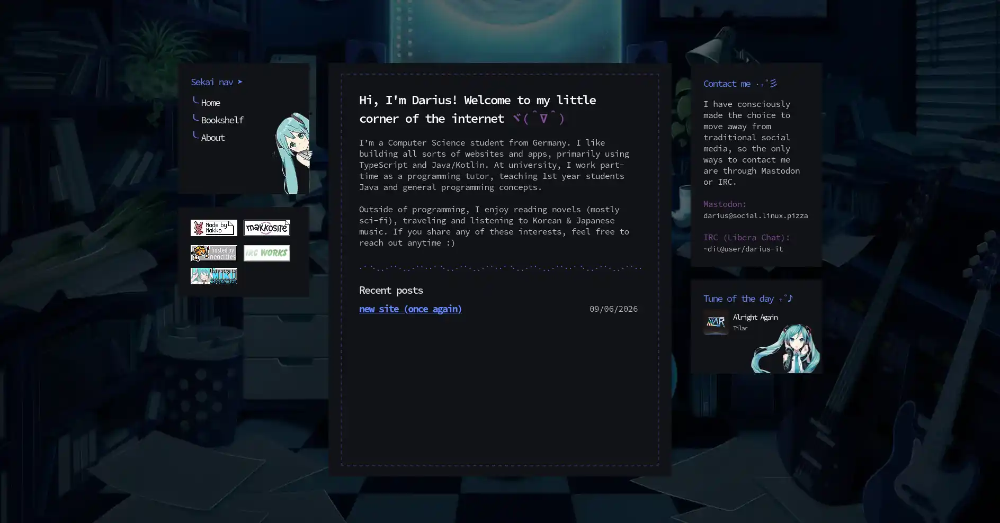

Once again, a new website! I've had a [mockup with a general style](https://social.linux.pizza/@darius/116407819054412606) laying around for a few weeks, and I thought I'd never get around to implement it.

But here we are, I'm procrastinating studiyng for an exam and instead building out a fun personal website :)

## Backstory

I'm a huge fan of Japanese music, and Hatsune Miku and Vocaloid songs are a huge part of this culture. Besides the usual "anime-style" songs, there are lots of artists making super cool EDM music that I really enjoy.

Here's one example: [Wooden - Conversations ft. Kasane Teto](https://soundcloud.com/woodenwasreal3489/conversations-feat-kasane-teto)

Inspired by this type of music, I wanted to make a Miku-themed site. Since my main site needs to stay a bit more "professional", my neocities site for random notes was the obvious choice, so here we are.

## The result

This is the current state of the website as of writing:

If you are reading this article at some point in the future, it might've changed a lot, or maybe not at all :P Only time will tell...

